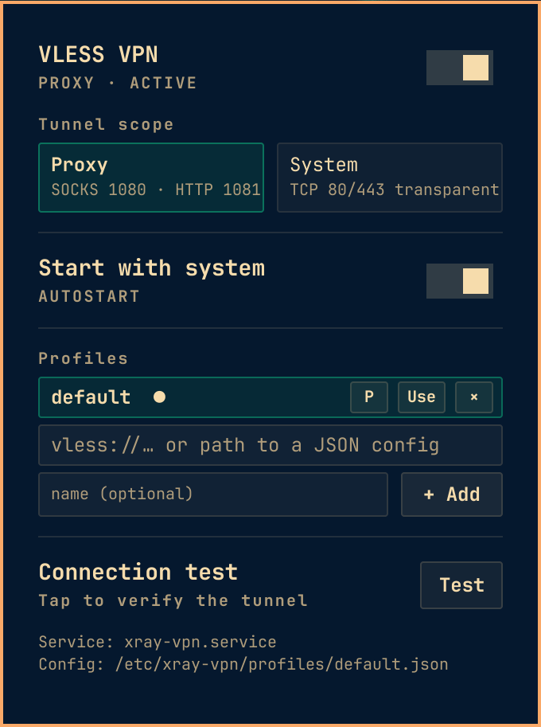

# kryaken.omarchy.vless — Xray VLESS VPN

Omarchy bar widget + system service that runs an Xray VLESS tunnel as a
systemd unit and lets you manage multiple server profiles (from `vless://`
links or xray/v2rayN JSON configs) from a panel or the CLI.

This is a user-installed plugin; it is not hardwired to any specific server.
Bring your own subscription link or config.

## Screenshots



## Compatibility

Built for the **Omarchy shell** (Hyprland + Quickshell, `qs.Commons` / `qs.Ui`
APIs, `schemaVersion` 1). It is an `omarchy plugin` bar widget for the
Omarchy bar and does not run in a standalone Quickshell or on other WMs.
Developed and validated on Omarchy 4.0.1.

## Requirements

- Omarchy with the shell, and `quickshell` running.
- `xray` (on Arch with an AUR helper: `yay -S xray-bin`).
- `python3`, `curl`, `iptables` (iptables is only needed for "system" mode).
- Root (via `sudo` on a TTY or `pkexec` from the panel) to manage the systemd
  service, `/etc/xray-vpn`, and iptables rules.

### Validate the setup

The panel shows a "REQUIRED SETUP" card with a copy-ready install command
whenever a dependency is missing. You can also verify dependencies from a
terminal:

```sh
bash ~/.config/omarchy/plugins/kryaken.omarchy.vless/backend.sh doctor
```

## Install

1. Install straight from Git (this places the plugin under its id
   `kryaken.omarchy.vless` and enables it for the shell):

   ```sh
   omarchy plugin add https://github.com/kryakenHub/KryakeN.Omarchy.Vless.git --enable
   ```

2. Restart the shell and open the VPN panel. Add your first profile (below),
   then toggle the tunnel on.

A fresh install starts with **no profiles** — add your first one in the
panel. If a previous `/etc/xray-vpn/config.json` from an older install
exists, it is migrated into a `default` profile on first run so your setup
is kept.

Alternatively, install manually:

```sh
git clone https://github.com/kryakenHub/KryakeN.Omarchy.Vless.git
cp -r KryakeN.Omarchy.Vless ~/.config/omarchy/plugins/kryaken.omarchy.vless
omarchy plugin validate "~/.config/omarchy/plugins/kryaken.omarchy.vless"
```

Then add the widget to the bar in `~/.config/omarchy/shell.json`, e.g. in
`bar.layout.right`:

```jsonc
{ "id": "kryaken.omarchy.vless" }
```

## Remove

Remove the widget from `shell.json`, then:

```sh
omarchy plugin remove kryaken.omarchy.vless
```

The plugin never writes inside the plugin folder — its runtime data lives in
`/etc/xray-vpn` and the `xray-vpn.service` unit, and those are left untouched
so the tunnel keeps working after the plugin is gone.

## Profiles

Profiles are stored as complete xray client configs under
`/etc/xray-vpn/profiles/<name>.json` (mode `0600`, root-only — they contain
UUIDs and server keys). The currently active one is mirrored to
`/etc/xray-vpn/config.json` for the systemd service. Profiles live in
`/etc/xray-vpn/profiles/`, never inside the plugin folder — your servers and
keys are not shipped with the plugin.

Add from a `vless://` subscription link, or import any xray/v2rayN JSON client
config (the first non-direct outbound is used, so VMess/Trojan/Shadowsocks
profile entries also work).

### CLI

```sh
backend.sh status                       # installed / running / modes + profiles
backend.sh profiles list                # list profile names
backend.sh profiles add mynode "vless://..."   # add from a link
backend.sh profiles add cfg "~/client.json"    # import from a JSON config
backend.sh profiles select mynode       # switch the tunnel to a profile
backend.sh profiles remove mynode
backend.sh profiles rename old new
backend.sh probe mynode                 # test a profile without switching
backend.sh test                         # test the running tunnel
backend.sh start | stop | toggle
backend.sh mode proxy | system
backend.sh enable | disable             # autostart with the system
backend.sh logs [n]
```

The first added profile is auto-activated. Privileged commands (everything
that touches `/etc/xray-vpn`, the unit, or iptables) use `sudo` from a TTY and
`pkexec` from the panel.

## Modes

- `proxy` — local SOCKS5 `127.0.0.1:1080`, HTTP `127.0.0.1:1081`.
- `system` — transparent TCP 80/443 of this host redirected (iptables) into
  xray on `:1082`. UDP/QUIC is left direct: the tunnel is TCP/gRPC and cannot
  carry UDP. Stop the VPN to remove the redirect rules.

## Authentication model (panel)

All privileged operations performed from the panel (toggle, mode, autostart,
profile add/select/remove) run through a single persistent helper process:
`pkexec /etc/xray-vpn/backend.sh serve`. Both this plugin and
`kryaken.omarchy.zapret` use the same shared scheme.

- On first used operation, `backend.sh` is provisioned to the root-owned
  `/etc/xray-vpn/backend.sh` (never re-copied on every action, so a tampered
  plugin checkout cannot inject code that then runs as root; refresh it after
  a plugin update with `sudo bash backend.sh install`).
- The helper is **not** started at boot — only on your first privileged action
  in a shell session. Starting it is the only point where a password is asked
  (`pkexec`, `org.freedesktop.policykit.exec`, default `auth_admin` — no custom
  polkit rules are installed).
- Every further request is sent as a JSON line over the helper's stdin and
  answered on its stdout (`{"id":...,"args":[...]} -> {"id":...,"code":...}`),
  so no password is needed again for the rest of the session.
- `vless://` links and profile JSON (which contain UUIDs/keys) are delivered to
  the helper over stdin, never on argv, so secrets never appear in the process
  table.
- The helper dies at logout (its stdin closes at session end) and holds no
  keep-alive; other `pkexec`/`sudo` programs are unaffected and keep asking for
  a password as usual.
- Handling it by hand:

```sh
   printf '%s\n' '{"id":1,"args":["toggle"]}' | pkexec /etc/xray-vpn/backend.sh serve
   ```

## AI assistance

This project was developed with AI assistance (vibecoding — pair-programming
with an LLM). Review the code and test it before relying on it for anything
sensitive.